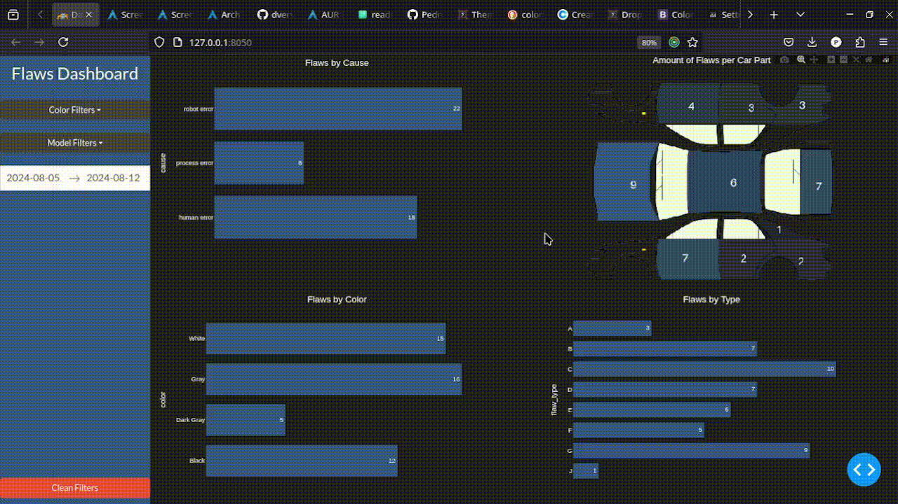
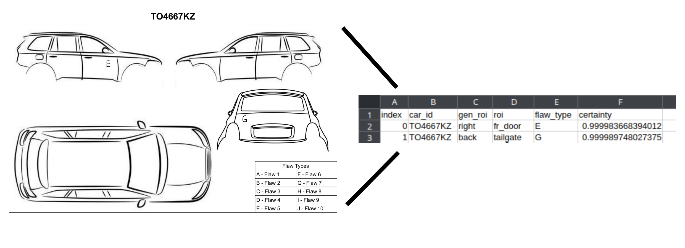

# OCR flaws DASH

Replica of one of the projects developed in my experience in the car industry. 



In the last step of the car paint process, a sheet of paper was attached to the car so the workers could fix any small problems with the paint coat. As the process was not informatized, all of the paper was thrown out and data was lost. This project works with easyOCR to transform annotations on paper into valuable data, which is then visualized with a dashboard on dash.



## Project Structure

```
├── dashboard
│   ├── assets/
│   ├── data/
│   └── app.py # run python app.py on the virtual environment to get the dashboard running
│
├── data_extraction
│   ├── diagrams/
│   ├── roi/
│   ├── data_extraction_script.ipynb
│   ├── detected_flaws.csv
│   └── roi_extracting_script.py
│
├── requirements.txt
│
└── README.md
```

## Running the Project

```bash
$ pip install -R requirements
$ source .venv/bin/activate
$ cd app/dashboard
$ python3 app.py # project should run on localhost
```

## Disclaimer

This project is a modified replica of one of the projets that I developed in my experience in the car industry. The original sheet, the models, and the flaw names were preserved to not put the company's intellectual property at risk.